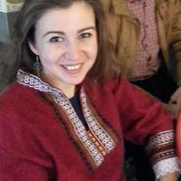

[get back to the main page](index.md)

# About Us

## Vesela Simeonova

I’m Vesela Simeonova, a post-doc in the project “The erotetic and the aesthetic” where we investigate literary suspense from an experimental perspective at the crossroad between formal linguistics and literary theory. The project is joint between Uni Graz and Uni Goettingen (Germany). We are currently carrying out three experiments testing a novel methodology and theory of suspense that interprets experiences of suspense in terms of questions. Before joining this project I was a post-doc in Igor Yanovich’s Emmy Noether project "Modal systems in historical Slavic languages” in Tuebingen, Germany, where I investigated the history of future tense in Bulgarian. Before that, I did my PhD at Uni Ottawa, Canada on the syntax and semantics of evidentiality and logophoricity. I am interested in perspectival phenomena, grammaticalized expressions of emotion, and complex clauses. 
You can find my papers, handouts, and full CV [here](https://kfunigraz.academia.edu/VeselaSimeonova).

 

## Lea Fricke

I am a research assistant at the German Department at the University of Graz. I am writing my dissertation on variation in wh-phrases in embedded questions in German.  From 2017 to 2021, I worked in the XPrag.de project “Exhaustiveness in embedded questions across languages”. Beside (embedded) questions my research interests include information structure, scalar implicatures and experimental methodology. I enjoy working experimentally and with corpora. Find out more about my research and other activities [here](https://homepage.uni-graz.at/de/lea.fricke/).

 

## Maya Cortez Espinoza

I am a  doctoral candidate at the linguistics department at Uni Graz. Also, I work as research assistent at the Department for German Studies. aCurrently, I am working in the Project „the erotetic and the aesthetic“, where we want to find out more about suspense in texts. In February of 2021, I graduated from the teachers training program. In my master thesis, I looked at the semantics of the German discourse particles "überhaupt" and "gar". I am very interested in formal semantics and pragmatics as well as their interfaces with syntax. 

[Here is the link to my homepage.](https://semanticsgraz.github.io/Semantics-Graz/)

 

## Simon Dampfhofer

I study German and Philosophy at Bachelor’s level as well as Physics at Master’s level. Since 2018, I’m a student assistant at the Department of German Studies, where I currently work on an experimental design on the diachronous change of presuppositions.
Further interests and topics I am working on include: formal linguistics in general, syntactical constraints on German evidential, and many aspects of philosophy of language.

 

## Lea-Sophie Kravanja 
I am a student assistant at the University of Graz and I study German Language and Literature as well as Linguistics in my bachelor’s degree. I am currently working on a corpus-linguistic study that focuses on the use of the definite article with proper names. 
I am interested in a wide range of topics and have therefore yet to decide which ones I will focus on in my upcoming master's degree. Due to working as a student assistent, I have discovered that I enjoy working with corpora and I also like to conduct experiments.

 

## Michaela Leeb

I am currently enrolled in the Bachelor's programme in Linguistics, German Studies and the Master's programme in Technical Physics, as I have finished the Bachelor's programme in Physics in 2021. At the Department of German Studies, I am working as a student assistant on a project that combines game theory and pragmatics. I am also engaged in another project that deals with variant grammar and the geographical evolution of language.

 

## Melanie Loitzl
I am a student assistant at the university of Graz currently doing my bachelor’s degree in teacher training with the subjects German and English and finishing my bachelor’s degree in German philology/German studies. At the moment, I am working on a corpus study on the use of the definite articles with proper names. As I am a student assistant, I am still discovering my topics of interest, but so far, I have noticed that I generally enjoy working on corpora and conducting experiments.

 

## Eva Winkler
I am doing the Bachelor´s degree in teacher training in the subjects German, Geography an History at the University of Graz. Beside that I am currently working with AMR. I am also interested in FrameNet. I enjoy working with experiments or corpora. 

 

