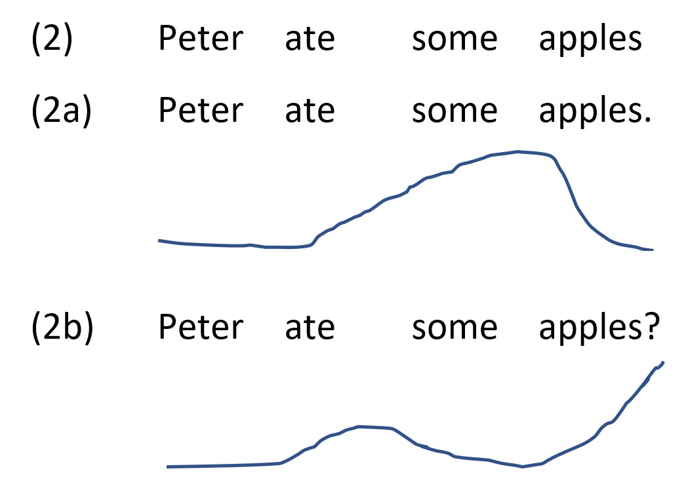

<h1>News/Activities</h1>

<a href="#SD1">BLOG ENTRY: Monday, June 13 2022: Simon presents ideas</a>

Separations within Linguistics and Limitations of Linguistics

<a href="#KH1">BLOG ENTRY: Monday, May 30 2022: Kathrin presents work in progress!</a>

Investigating the influence of explicit and implicit questions in literary texts

<a href="#LF1">BLOG ENTRY: Monday, May 2nd 2022: Lea reports on our trip to Vilnius!</a>

Arqus twinning workshop in Vilnius

<a href="#VS1">On Friday, April 22, Vesela Simeonova presented at the Chicago Linguistic Society</a>

Epistemic Future in Reflective Questions

<a href="#MC1">BLOG ENTRY: April 15th 2022 Maya Cortez Espinoza presents work in progress</a>

Predicting the Interpretation Probabilities with the help of the Monte Carlo Simulation

<a href="#ML1">BLOG ENTRY: March 18th 2022: Melanie Loitzl presents work in progress</a>

The role of gender in the usage of the definite article with proper names in German

    <h4>Simon presents ideas. Blog entry on June 13th, 2022. </h4>
    <h3 style="margin-top:0pt"> Separations within Linguistics and Limitations of Linguistics</h3>

Language is complicated. To see this, let’s have a look at a seemingly simple sentence:  

    1. Peter ate some apples. 
    2. John ate some pears.  
    
“Why would this sentence show that language is complicated?”, you can ask. Let me answer with some questions in turn. What does this sentence mean, what its individual words? What is the difference between it and a declarative question like “Peter ate some apples?”? How is it that when reading this sentence, you immediately can make sense of what it means? If I ask you to give me answers to these questions, to really explain the how and why and what of this sentence in a consistent way, it will become apparent that language is indeed complicated.  
    
One common (and often practical) way to deal with complicated things is to split them into smaller, more manageable units. This is what happens in the case of language, and as a consequence, linguistics is separated into many different areas. Levine/Rowe (2018), an introductory textbook on linguistics, includes sections on phonetics, phonology, morphology, syntax, semantics, pragmatics, sociolinguistics, linguistic anthropology, and language acquisition, among others. Let’s get back to our example for a moment. We can see that the sentence, as you see it before you, is composed out of written words, which themselves are composed out of letters. To explain this formal structure, you could consult morphology and syntax. If we heard someone say this sentence, we could also divide our experience into smaller units (for example, single vowel sounds, like the sound of the first <em>“e”</em> in <em>Peter</em>, as well as larger prosodic structures. This you could analyze with the help of phonetics and phonology. We could also ask what the sentence means and observe that its meaning as a whole seems in some way to be connected with the meanings of the individual words it contains. This would be the area of expertise of semantics. Finally, there are some more abstract aspects of language. For example, psycholinguistics might try to find out what your mental concept of an apple looks like, and how it differs from my concept of an apple.  
    
So, what we have are many theories, each enabling us to cover one different aspect of our sentence. But the process of actually understanding this sentence in our minds doesn’t seem to be composed out of many different aspects – I would say that what we usually do when we read a sentence (which is, admittedly, quite different from analyzing it linguistically) is to grasp it as a whole. In our minds, its formal realization is not independent from its meaning, which in turn is not independent from the speaker’s intention. So how do combine the things individual linguistic theories tell us about this sentence into one unified analysis? In many cases, we don’t – and often, that’s completely fine. We <em>can</em> regard aspects of language as independent of each other. Then it would be totally ok to say that phonology describes the phonology-aspect of an utterance, morphology the morphology-aspect, and so on. In many other cases, however, splitting language into independent parts like this would be a simplification. In the usual case, different aspects of language are not independent of each other, but interact in various ways.  
    
Many of these interactions can also be explained theoretically. Let’s again consider some examples. One such interaction involves prosody, which is a subpart of phonetics. Prosody is concerned with the acoustic perception of larger units of speech, i.e., syllables or phrases. Imagine our example sentence with two different pitch patterns. I very roughly sketched them below; when looking at the examples, imagine that a line going up corresponds to rising pitch at this position in the sentence, and a line going down to falling pitch. If you are unfamiliar with this, you can probably more easily recognize the different pitch patterns when you try to pronounce the two different possibilities, (2a) and (2b), aloud for yourself.  
            
    
Note that in the neutral (2) where I left out punctuation, it is not apparent without prosody whether the sentence should be understood as an assertion or as a declarative question. Only when prosody comes in, can this ambiguity be resolved. This is an area where prosody interacts with semantics; after all, an assertion means something different from a question.  
    
Another example is the interaction of semantics with pragmatics. As we already discussed, we could input meanings of individual words when computing the total meaning of the sentence. How do we know such word-meanings? Often this is easy. Semantics would assign a meaning to each word which would represent what the word corresponds to in the real world. For example, the meaning of “Peter” could then be some specific person named Peter. The idea is that in most cases, the meaning of words is stored in some kind of mental lexicon. However, in some cases additional meaning components can come in. These could, for example, depend on the context of the utterance or the intention of the speaker. One specific case of such an additional meaning is present in our example sentence: namely, the phenomenon of scalar implication. The idea is this: scalar expressions describe, as the name suggests, a scale. In the case of apples, this scale would be “no apples – some apples – all apples”. Since we know that a speaker has access to all expressions on this scale, we can draw additional inferences from the fact that she/he chose one expression over the others (Horn 1972). In particular, if a speaker uses “some”, this implies that she/he was unable to use the stronger “all”. Then, the meaning of “some” changes from an inclusive “some and possibly all” to an exclusive “some but not all”. So, our example sentence could be compatible with Peter eating <em>all</em> apples, but only if we <em>don’t accept</em> the scalar implicature. If we <em>do accept</em> it, the sentence would express that Peter ate some <em>but not all </em>apples.  
    
As we could see, connecting different linguistic theories is very much possible in some cases. In others, however, the connections between different areas of linguistics seem less clear. Language is complicated, and unfortunately, so are its parts and their connections to each other. Some gaps between areas are so large that they seem unbridgeable. Such gaps put a limit on what can reasonably be studied in linguistics. We will try to explore some of these limits next. Going back to our example sentence, we could ask some more difficult questions. Are the objects that you picture Peter eating when reading this sentence the same as the things I picture when I read it? Is the motivation or the intention of the speaker in some way connected to the form or the meaning of the utterance? Is there even such a thing as an apple, or apples just made-up linguistic objects and nothing outside of our minds, outside of language even exists? Many linguists would probably say that these questions are too difficult to answer. They involve areas of linguistics that are too different, that have too complicated interactions. For all practical reasons, some areas of language are truly separate from others.  
    
Theorists often explicitly acknowledge these separations, particularly when it comes to discussing limitations of their own theories. For example, in their introduction to intensional semantics, Heim and von Fintel discuss several theories on why a certain semantic operator cannot appear at a certain position in a semantic expression. One such theory, they say, would place “the burden on a theory of morphological spell-out” (2021, 126); this alone is reason enough for them to not discuss this issue further. Arguments like these seem perfectly valid at first glance. One doesn’t need to explain a particular phenomenon if that phenomenon falls outside of the area one works in, after all. But these separations can be artificial: they are in some cases not real features of language but rather artifacts introduced by the theory. What if we didn’t have such separations in our theory? What if we tried to unify linguistics in some way? This would, I think, enable us to answer research questions that currently feel out of reach. We could investigate intricate interactions between far-apart fields of linguistics. We could explain how language works in a more nuanced way.  
    
By arguing for the removing of separations, I’m not demanding that every theory needs to explain every area of language – that would be ridiculous. Of course, there can (and should!) be theories which explain only very specific and limited aspects of language – <em>if</em> these limitations are due to <em>actual features of language and not artifacts of language theory</em>. By arguing for unification, I’m also not demanding that there should be one theory covering everything. Linguistics as a field currently contains lots of competing theories, and it could stay this way: there could, for example, be one theory explaining how speaker motivation is connected to the form of an utterance, as well as another, competing theory that argues that actually everything is different, and that the first theory is totally wrong. Scientific competition is healthy, as it promotes the exploration of different ideas.  
    
Language is complicated. But if we managed to cover these complexities and unite them in a linguistic “theory of everything” (an unimaginably difficult task, no doubt), this would enable us to get answers to questions that currently seem far out of reach of linguistic theory.  
    
Literature
Heim, Irene and von Fintel, Kai (2021): Intensional Semantics. Spring 2021 Edition.
Horn, Laurence Robert (1972): On the Semantic Properties of Logical Operators in English. Dissertation, University of California.
Levine, Diane P. and Rowe, Bruce M. (2018): A Concise Introduction to Linguistics. London, Routledge. DOI: 10.4324/9781315227283.

    <h4>Kathrin presents work in progress. Blog entry on May 30th, 2022. </h4>
    <h3 style="margin-top:0pt"> Investigating the influence of explicit and implicit questions in literary texts </h3>

I am currently working on my B.A. thesis, which investigates from an experimental perspective whether the type of questions posed by a literary text changes its reception. The central assumption is that the structure of texts results from questions and their corresponding answers. These questions are usually not formulated explicitly but arise implicitly from the text. I hypothesize that the way a text is received depends on whether those erotetic questions are implicit or explicit. While explicit questions are more likely to provoke the reader's desire for an immediate answer, implicit questions are more likely to motivate the reader to engage with the narrative and to infer its inherent questions and the corresponding answers from the unfolding text.
The study will show whether literary texts raising implicit questions evoke a more intensive engagement with them than texts raising explicit questions. Moreover, my study has the potential to provide empirical justification for the erotetic question-answer model by showing to what extent the design of the erotetic structure influences the reception of literature. 
I have already received confirmation of funding for my project from the LingLab-program, a cooperation of several linguistic institutes of the University of Graz to support empirical linguistic work, so now as the next step I am about to recruit participants. I am looking forward to the implementation of my study.

    <h4>Lea reports on our trip to Vilnius! Blog entry on Monday, May 2nd 2022</h4>
    <h3 style="margin-top:0pt">Arqus twinning workshop in Vilnius</h3>
    

       

       

        

Together with <a href="https://alexandrecremers.com/">Alexandre Cremers</a>, researcher at Vilnius University, we organized a joint workshop as part of the twinning program by the <a href="https://www.arqus-alliance.eu/">Arqus European University Alliance</a>.          
Five students of our group travelled together with Edgar Onea to Vilnius for a week to work on methodological questions in empirical linguistic research. The workshop thematically connected to and built on an ongoing cooperation between Alexandre Cremers, Edgar Onea and Lea Fricke. In their joint research, they experimentally investigate different prompts and response tasks commonly used in linguistic research with regard to their validity and their efficiency. The program of our workshop included sessions on statistical model building, Bayesian statistics and experimental design as well as talks by Alexandre Cremers, Maya Cortez, Lea Fricke and Edgar Onea. We learned a lot in this week and enjoyed the exchange with students from the philology department in Vilnius. Beside the academic activities, we explored the beautiful capital of Lithuania, went on a trip to Trakai island castle, and got to know plenty of local delicacies.
  
 
    

    <h4>Vesela presented at the <a href="http://chicagolinguisticsociety.org/">CLS 58 </a> on April 22nd</h4>
    <h3 style="margin-top:0pt">Epistemic Future in Reflective Questions</h3>
    
Find the poster and additional information <a href = "https://semanticsgraz.github.io/Semantics-Graz/previous_talks/vesela_cls.html"> here </a> or 
        <a href="mailto:vesela.simeonova@uni-graz.at">write me an e-mail</a>.
    
  

    <h4>Maya presents work in progress. Blog entry on April 15th, 2022</h4>
    <h3 style="margin-top:0pt">Predicting the Probability of an Interpretation with the help of the Monte Carlo Simulation</h3>
    

<a href="https://homepage.uni-graz.at/de/lea.fricke/">Lea Fricke</a> and I recently conducted an experiment on the effect of tense on scalar implicatures (SIs in the following). In this study, subjects had to judge sentences like (1) and (2) with respect to contexts in which everybody of a relevant set of people performed an activity or just a subset of these people. The idea is that for past tense sentences like (1), a scalar implicature is very likely to arise and “some” will be interpreted as “some and not all”. This means, in a context in which the whole set of people performed the respective activity, the sentence will likely be judged false, but sentences, in which just a subset of people performed the activity, the sentence will be true. For future tense sentences like (2), the SI will not be present, “some” will mean “some and possibly all”, and for both kinds of context, the sentence will be judged true. 
      
    
We hypothesize, however, that subjects can access both readings ([+SI ~ “some and not all”] and [-SI ~ “some and possibly all”]) and have beliefs about how likely a sentence is to have a certain reading. We further believe that these reading probabilities vary for each person and for each of the two tenses (additionally to varying between other factors as well), and to judge a sentence a certain way, the respective reading has to have sufficiently high probability. More concretely, we assume that for each tense, the probability of a reading is “beta-distributed” within a population. Just like with a normal distribution, there are values (of reading probabilities), that are more likely to be found in members of the population and there are values that are less likely to be found. Finding the parameters of this distribution is, however, not quite trivial. 
Our goal is to do this using a Markov-Chain-Monte-Carlo-Simulation. This is a mathematical method for solving complex statistical problems with the help of chance. The underlying idea is the law of large numbers: When running independent tests repeatedly, the found parameters will converge with the real parameters as the number of trials approaches infinity. As can be seen in the following, this principle is in accordance with one’s intuition. When throwing a coin, the higher the number of throws, the better we know the probabilities for getting heads/tails as a result.  This means that drawing random samples is the key to estimating probabilities if the probabilistic space is too large to be covered entirely. 
Applying this idea, we create parameters for a possible distribution of reading probabilities. From this distribution, we draw random samples, i.e. we sample random people from an imagined population. We then compare how close these randomly sampled people are to the people we had in our experiment, considering the data we gathered. What we get is a likelihood with which our data fits the distribution. Then, we change the parameters of our distribution slightly and sample randomly again to see whether the new distribution fits our data better. If it does, we accept the new distribution and move on from there, if not, we use the old distribution again, change the parameters slightly and see where we get. We do this very, very often (e.g. 2000 times) and eventually, we will have many distribution parameters, most often those that fit our data best. And with that, we know which parameters of a distribution are likely to be in the population we experimented on. So in the end, we expect to find significantly different distributions for both tenses. And just like that, we will know whether the interpretation of “some” differs between future and past sentences. 

  

    <h4>Melanie presents work in progress. Blog entry on March 18th, 2022. </h4>
    <h3 style="margin-top:0pt"> The Role of Gender in the Usage of the Definite Article with Proper Names in German </h3>

Last week Melanie gave first insights into our research project on the use of definite articles with proper names.
We tested a previous work’s hypothesis that there is a difference between the article usage before male and female first names. 
(Other gender identities cannot be taken into account because our corpus of language data does not provide specific information about this.) 
Based on our current data, there seems to be little difference between the two genders, both in terms of the usage of a definite article in general 
(i. e. optional + required definite articles together) and in terms of only the optional usage of a definite article. However, 
as to the case of the general usage of the definite article an article appears to be used more often with female names in dative. 
If this difference is statistically significant, we have yet to find out, because we are still calculating our data at the moment.
Our working hypothesis is that the use of definite articles often expresses a relationship of proximity but can also have pejorative purposes.

