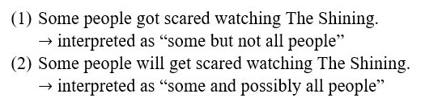

<h1>Here, you find our most recent activities</h1>

<a href="#ML1">Melanie Loitzl</a>

The role of gender in the usage of the definite article with proper names in German

<a href="#MC1">Maya Cortez Espinoza</a>

Predicting the Interpretation Probabilities with the help of the Monte Carlo Simulation

    <h3> role of gender in the usage of the definite article with proper names in German </h3>

    Last week Melanie gave first insights into our research project on the use of definite articles with proper names.
    We tested a previous work’s hypothesis that there is a difference between the article usage before male and female first names. 
    (Other gender identities cannot be taken into account because our corpus of language data does not provide specific information about this.) 
    Based on our current data, there seems to be little difference between the two genders, both in terms of the usage of a definite article in general 
    (i. e. optional + required definite articles together) and in terms of only the optional usage of a definite article. However, 
    as to the case of the general usage of the definite article an article appears to be used more often with female names in dative. 
    If this difference is statistically significant, we have yet to find out, because we are still calculating our data at the moment.
    Our working hypothesis is that the use of definite articles often expresses a relationship of proximity but can also have pejorative purposes.

    <h3>Predicting the Probability of an Interpretation with the help of the Monte Carlo Simulation</h3>
    

    The Monte Carlo Simulation is a mathematical method for solving complex problems with the help of chance. 
    The underlying idea is the law of large numbers. It says that when running independent tests repeatedly, the chance that the probability 
    for the found outcomes differing from the true probability converges to zero as the number of trials goes to infinity. This means that drawing random samples 
    is the key to estimating probabilities if the probabilistic space is too large to be covered in total. 
    Lea Fricke and I recently conducted an experiment on students of Graz University to find out more about scalar implicatures. 
    Amongst other questions, we were interested in the dependence of the interpretation of scalar terms on the tense of the sentence. 
    More concretely, a scalar implicature is computed if a term like “some” is interpreted as “some and not all” as can be seen in (1). 
    If “some” appeared in a future tense sentence, see (2), the implicature is less likely drawn and “some” is more likely to mean “some and possibly all”. 
      
    To determine the likelihood for each of the two readings ([+Scalar Implicature]/ [- Scalar Implicature]) for both tenses, 
    we want to conduct a Markow Chain Monte Carlo Simulation. This means that we estimate for each tense what the probabilities may be for each reading. 
    From this estimation, we draw a number of random samples and compare the result to the sample that we got from the experiment. 
    In the next step, we change our probability estimation slightly, draw random samples again and compare it to our real sample. 
    If the new estimation gives us better results than the first, we move on from there. An algorithm will do this for us many, 
    many times in just a few seconds and ultimately, we arrive at probabilities for both readings that are highly likely to be very 
    close to the reading probabilities as they are found in the population of German speakers.
  

