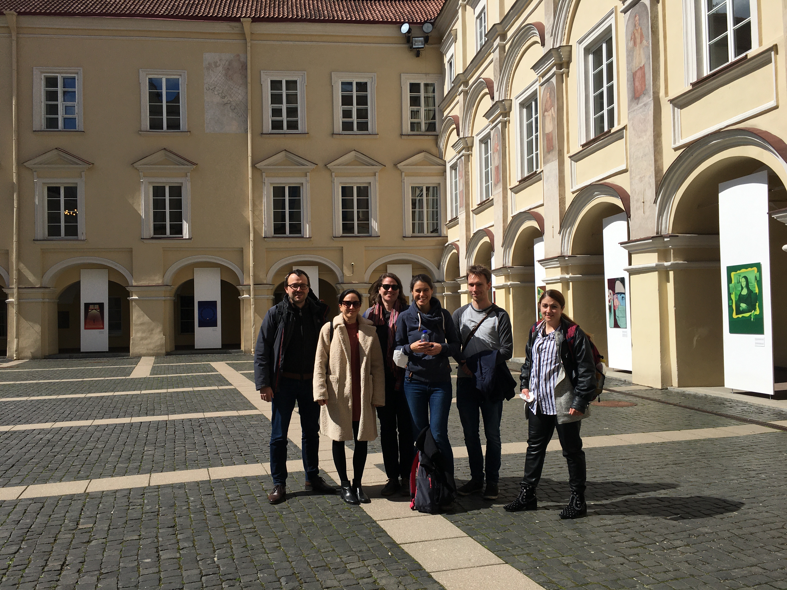

<h1>News/Activities</h1>

<a href="#LF1">BLOG ENTRY: Monday, May 2nd 2022: Lea reports on our trip to Vilnius!</a>

Arqus twinning workshop in Vilnius

<a href="#VS1">On Friday, April 22, Vesela Simeonova presented at the Chicago Linguistic Society</a>

Epistemic Future in Reflective Questions

<a href="#MC1">BLOG ENTRY: April 15th 2022 Maya Cortez Espinoza presents work in progress</a>

Predicting the Interpretation Probabilities with the help of the Monte Carlo Simulation

<a href="#ML1">BLOG ENTRY: March 18th 2022: Melanie Loitzl presents work in progress</a>

The role of gender in the usage of the definite article with proper names in German

    <h4>Lea reports on our trip to Vilnius! Blog entry on Monday, May 2nd 2022</h4>
    <h3 style="margin-top:0pt">Arqus twinning workshop in Vilnius</h3>
    

       

        

Together with <a href="https://alexandrecremers.com/">Alexandre Cremers</a>, researcher at Vilnius University, we organized a joint workshop as part of the twinning program by the <a href="https://www.arqus-alliance.eu/">Arqus European University Alliance</a>.  

       

        
Five students of our group travelled together with Edgar Onea to Vilnius for a week to work on methodological questions in empirical linguistic research. The workshop thematically connected to and built on an ongoing cooperation between Alexandre Cremers, Edgar Onea and Lea Fricke. In their joint research, they experimentally investigate different prompts and response tasks commonly used in linguistic research with regard to their validity and their efficiency. The program of our workshop included sessions on statistical model building, Bayesian statistics and experimental design as well as talks by Alexandre Cremers, Maya Cortez, Lea Fricke and Edgar Onea. We learned a lot in this week and enjoyed the exchange with students from the philology department in Vilnius. Beside the academic activities, we explored the beautiful capital of Lithuania, went on a trip to Trakai island castle, and got to know plenty of local delicacies.
  
 

    <h4>Vesela presented at the <a href="http://chicagolinguisticsociety.org/">CLS 58 </a> on April 22nd</h4>
    <h3 style="margin-top:0pt">Epistemic Future in Reflective Questions</h3>
    
Find her poster and additional information here!
        <a href="mailto:vesela.simeonova@uni-graz.at">Write me an e-mail</a>
    
  

    <h4>Maya presents work in progress. Blog entry on April 15th, 2022</h4>
    <h3 style="margin-top:0pt">Predicting the Probability of an Interpretation with the help of the Monte Carlo Simulation</h3>
    

    The Monte Carlo Simulation is a mathematical method for solving complex statistical problems with the help of chance. The underlying idea is the law of large numbers: When running independent tests repeatedly, the found parameters will converge to the real parameters as the number of trials goes to infinity. This agrees with our intuition. When throwing a coin, the higher the number of throws, the better we know the probabilities for getting head/tail as a result.  This means that drawing random samples is the key to estimating probabilities if the probabilistic space is too large to be covered in total. Think of an opinion poll. If want to know society’s opinion on something, you cannot ask the whole population for their opinion. But drawing random samples and asking a small number of people is manageable and doing this repeatedly will get you fairly close to the opinion of the population.  
Lea Fricke and I recently conducted an experiment on students of Graz University.  to find out more We were interested in a phenomenon called scalar implicature – in particular, we investigated the effect of tense on Scalar Implicatures. If a scalar term like ‘some’ is interpreted as ‘some and not all’, additional information is extracted, which is not part of the basic meaning of the word. Linguists say that ‘a scalar implicature is computed’. An example can be seen in (1). A study on children in 2000 found that if ‘some’ appeared in a future tense sentence (see (2)), the implicature does not arise and ‘some’ is more likely to mean ‘some and possibly all’. 
      
    
In our experiment, people had to judge sentences like (1) and (2) with respect to contexts that rendered the one reading ([-Scalar Implicature]) true and the other ([+Scalar Implicature]) false. We hypothesize that judging a sentence to be true or false requires the participant to have a sufficiently high probability for the respective reading. We further hypothesize that the population of German speakers has reading probabilities that are normally distributed around a mean and each participant is part of that population with their probabilities deviating within this distribution. With a Markow Chain Monte Carlo Simulation we intend to determine the probabilities for each of the two readings ([+Scalar Implicature]/ [- Scalar Implicature]) as they are found in the population of German speakers.  
This is done the following way: We create a population with invented reading probabilities. We draw a large number of random samples from this population and see how likely it is to get the results we we actually got in our experiment. We thereby pretend that the imagined population was the one (the population of German Speakers) we took our real sample from. An algorithm will then change the population probabilities slightly and draw random samples again. It will and compare the two results, changing new probabilities according to these results.  
Eventually, it will determine the population with reading probabilities that fit best the results we found in our experiment. We do this for both tenses and will arrive at a conclusion whether the reading probabilities differ between them. 

  

    <h4>Melanie presents work in progress. Blog entry on March 18th, 2022. </h4>
    <h3 style="margin-top:0pt"> The Role of Gender in the Usage of the Definite Article with Proper Names in German </h3>

    Last week Melanie gave first insights into our research project on the use of definite articles with proper names.
    We tested a previous work’s hypothesis that there is a difference between the article usage before male and female first names. 
    (Other gender identities cannot be taken into account because our corpus of language data does not provide specific information about this.) 
    Based on our current data, there seems to be little difference between the two genders, both in terms of the usage of a definite article in general 
    (i. e. optional + required definite articles together) and in terms of only the optional usage of a definite article. However, 
    as to the case of the general usage of the definite article an article appears to be used more often with female names in dative. 
    If this difference is statistically significant, we have yet to find out, because we are still calculating our data at the moment.
    Our working hypothesis is that the use of definite articles often expresses a relationship of proximity but can also have pejorative purposes.

