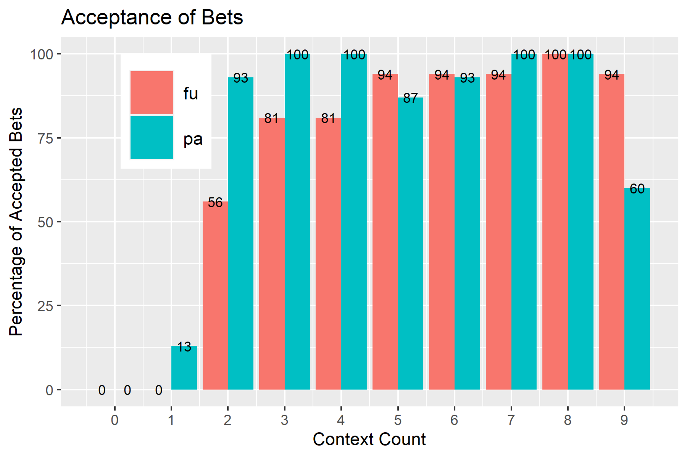

## On the interpretation of German ’einige’: The effect of tense and cardinality
Scalar terms like „some“ are known to be interpreted by default as “some and not all”. 
This meaning strengthening called scalar implicature stands in opposition to the logical meaning of “some” which includes the stronger alternative “all”.
Lea Fricke and I conducted an experiment that tested this phenomenon a lab setting which aimed to test people’s judgment on scalar implicatures under new conditions. 
Firstly, we aimed for a peak participant effort by financially rewarding good answers. 
Our second goal was to shift the focus of the experiment to a more conversation-like context where participants were told their answers would be evaluated by potential conversational partners.

In this setting, we tested the effects of tense and cardinality on the interpretation of the German scalar term *einige* (engl. 'some'). 
Following a previous study by Chierchia et al. (1998), we predicted that when presented under future tense, *einige* would be interpreted as “some and possibly all”, i.e. without the scalar implicature, while under past tense, the scalar implicature would arise and *einige* would mean “some and not all”.
Moreover, we followed Van Tiel/Geurts 2014 and Degen/Tanenhaus 2015 in assuming that higher portions of a basic set result in a higher acceptance rates. 
More concretely, a sentence like “Hans hat einige Äpfel gegessen” (Hans ate some apples), was predicted to be better in a situation where John ate four out of six apples than in a situation where John ate two out of six apples. 
Besides from finding support for these hypotheses in our data, we found another interesting aspect that turned out to be significantly above chance: 
Tolerance for future tense *einige* when presented in a context with low cardinalities was significantly lower than tolerance for past tense *einige*.
This is quite surprising and gives us a very interesting path for future research. 

